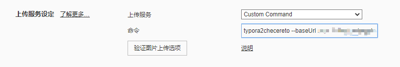
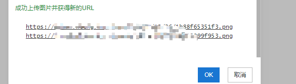

# typora2chevereto

`typora`中自动上传图片至`chevereto`.

## 使用



其中`setting`:

```bash
typora2chevereto --baseUrl <baseUrl> --key <key>
```

其中：

* `baseUrl`: `chevereto`站点地址,`http`或`https`
* `key`: 密钥,管理员账号登录,`仪表盘`→`设置`→`API`中获取

## 上传至某一用户

默认图片上传至管理员账户下，要上传至某一账户下，将`app/routes/route.api.php`文件复制到`app/routes/overrides/route.api.php`，找到:

```php
CHV\Image::uploadToWebsite($source);
```

改成:

```bash
CHV\Image::uploadToWebsite($source, '<usernameOrId>');
```

`<usernameOrId>`为目标用户的用户名或`id`.


